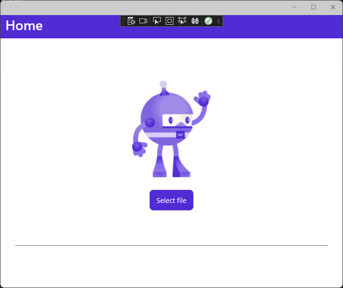
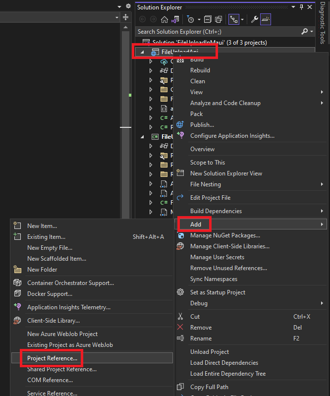
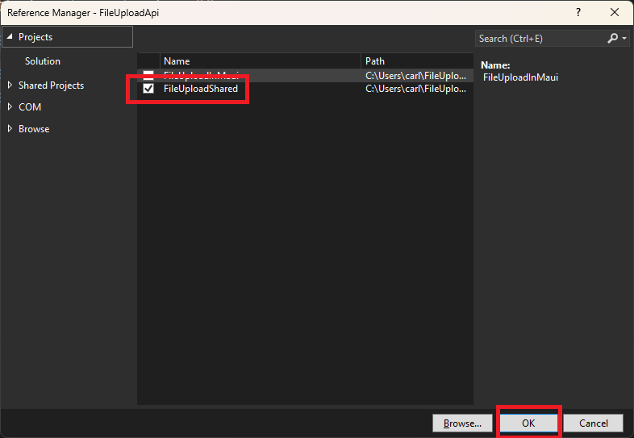
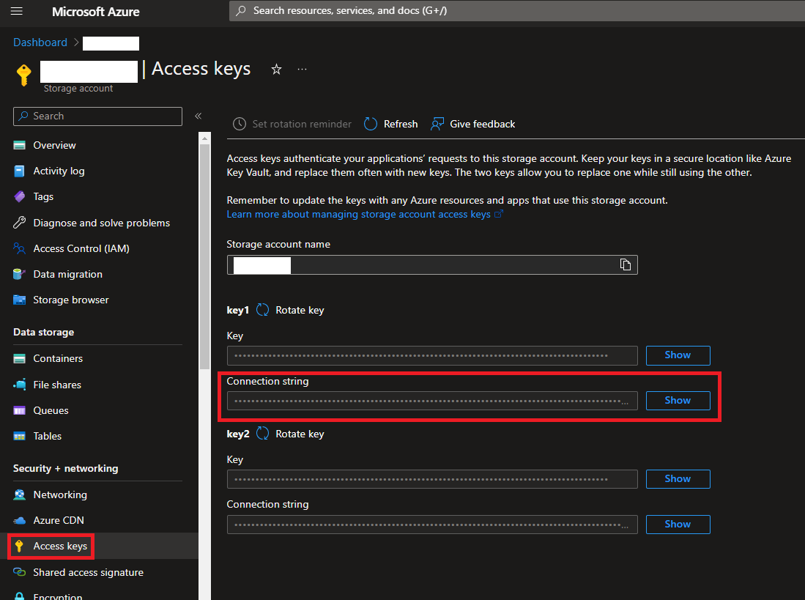
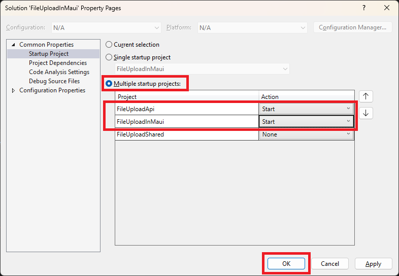
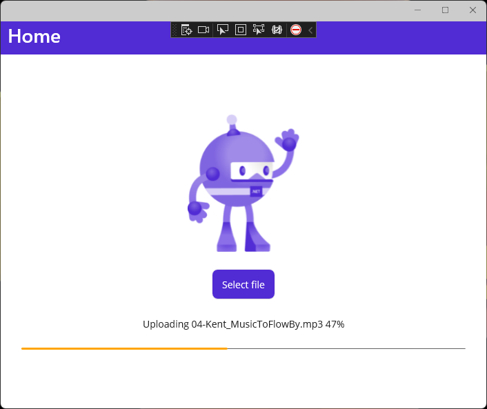
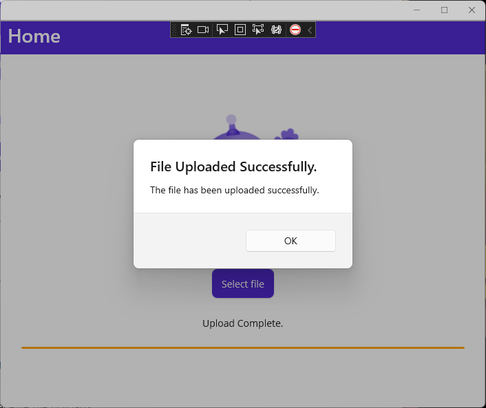

# Introduction

In this episode, we are going to update the application we created in episode 36 of [The .NET Show](https://thedotnetshow.com) to support uploading of large files one chunk at a time. We will also add an option to have the server forward our uploads to an Azure Blob Storage Container. The original repo for episode 36 is at https://github.com/carlfranklin/FileUploadInMaui

End results will look like this:




Let's get started.

## Prerequisites

The following prerequisites are needed for this demo.

### .NET 7.0

Download the latest version of the .NET 7.0 SDK [here](https://dotnet.microsoft.com/en-us/download).

#### Visual Studio 2022

For this demo, we are going to use the latest version of [Visual Studio 2022](https://visualstudio.microsoft.com/vs/community/).

### Required Workloads

In order to build **.NET MAUI** applications, you need the **.NET Multi-platform App UI development** workload to be installed. In order to build **ASP.NET Core Web API** applications, you need the **ASP.NET and web development** workload, so if you do not have them installed let's do that now.

  

### Clone the following project:

https://github.com/carlfranklin/FileUploadInMaui

Add a Class Library project to the solution named *FileUploadShared*, and add the following class file to it:

*FileChunk.cs*:

```c#
namespace FileUploadShared;

public class FileChunk
{
    public string FileNameNoPath { get; set; } = "";
    public long Offset { get; set; }
    public byte[] Data { get; set; }
    public bool FirstChunk = false;
}
```

Add Project References from *FIleUploadInMaui* and *FileUploadApi* to *FileUploadShared*

To do this, right-click on the Project file, in this case *FileUploadApi*, select **Add**, and then **Project Reference**



Then select *FileUploadShared* from the list, and select **OK**:



Repeat this process for the *FileUploadInMaui* project.

## Server Configuration

To the *FileUploadApi* project, add the following package reference:

```xml
<PackageReference Include="Azure.Storage.Blobs" Version="12.8.0" />
```

Next, add the following class file:

*AzureStorageHelper.cs*:

```c#
using Azure.Storage;
using Azure.Storage.Blobs;
using Azure.Storage.Blobs.Models;

namespace FileUploadApi;

// This code requires Nuget Package "Azure.Storage.Blobs"

public class AzureStorageHelper
{
    IConfiguration configuration;
    string baseUrl = "";
    public AzureStorageHelper(IConfiguration _configuration)
    {
        configuration = _configuration;
        baseUrl = configuration["StorageBaseUrl"];
    }

    public async Task<List<string>> GetFileList(string containerName)
    {
        var files = new List<string>();
        var container = OpenContianer(containerName);
        if (container == null) return files;

        try
        {
            // get the list
            await foreach (BlobItem item in container.GetBlobsAsync())
            {
                var Url = container.Uri.ToString() + "/" + item.Name.ToString();
                files.Add(Url);
            }
        }
        catch (Exception ex)
        {
            var msg = ex.Message;
        }

        return files;
    }

    public async Task<string> UploadFile(string containerName, string sourceFilename, 
        string destFileName, bool overWrite)
    {
        var container = OpenContianer(containerName);
        if (container == null) return "";
        try
        {
            // Specify the StorageTransferOptions
            BlobUploadOptions options = new BlobUploadOptions
            {
                TransferOptions = new StorageTransferOptions
                {
                    // Set the maximum length of a transfer to 50MB.
                    // If the file is bigger than 50MB it will be sent in 50MB chunks.
                    MaximumTransferSize = 50 * 1024 * 1024
                }
            };

            BlobClient blob = container.GetBlobClient(destFileName);

            if (overWrite == true)
            {
                blob.DeleteIfExists();
            }

            using FileStream uploadFileStream = File.OpenRead(sourceFilename);
            await blob.UploadAsync(uploadFileStream, options);
            uploadFileStream.Close();
            // return the url to the blob
            return $"{baseUrl}{containerName}\\{destFileName}";
        }
        catch (Exception ex)
        {
            var msg = ex.Message;
            return "";
        }

    }

    public async Task<string> DownloadFile(string containerName, string sourceFilename, string destFileName)
    {
        var container = OpenContianer(containerName);
        if (container == null) return "";

        try
        {
            BlobClient blob = container.GetBlobClient(sourceFilename);

            BlobDownloadInfo download = await blob.DownloadAsync();

            using (FileStream downloadFileStream = File.OpenWrite(destFileName))
            {
                await download.Content.CopyToAsync(downloadFileStream);
                downloadFileStream.Close();
            }
            return "OK";
        }
        catch (Exception ex)
        {
            var msg = ex.Message;
            return "";
        }
    }

    BlobContainerClient OpenContianer(string containerName)
    {
        try
        {
            string setting = configuration["StorageConnectionString"];

            // Create a BlobServiceClient object which will be used to create a container client
            BlobServiceClient blobServiceClient = new BlobServiceClient(setting);

            // Create the container and return a container client object
            return blobServiceClient.GetBlobContainerClient(containerName);
        }
        catch (Exception ex)
        {
            var msg = ex.Message;
            return null;
        }
    }
}
```

Next, replace the *appsettings.json* file with the following:

```Json
{
  "Logging": {
    "LogLevel": {
      "Default": "Information",
      "Microsoft.AspNetCore": "Warning"
    }
  },
  "AllowedHosts": "*",
  "StorageConnectionString": "[YOUR AZURE STORAGE CONNECTION STRING]",
  "StorageBaseUrl": "[YOUR STORAGE BASE URL ENDING WITH /]"
}
```

You will need to update `StorageConnectionString` and `StorageBaseUrl` with the values you can find in the Azure Storage account



Next, add a *Controllers* folder, and to it add *FilesController.cs*:

```c#
using Microsoft.AspNetCore.Mvc;

namespace FileUploadApi.Controllers;

[ApiController]
[Route("[controller]")]
public class FilesController : ControllerBase
{
    AzureStorageHelper azureStorageHelper;

    public FilesController(AzureStorageHelper _azureStorageHelper)
    {
        azureStorageHelper = _azureStorageHelper;
    }

    [HttpGet("{ContainerName}/blobs")]
    public async Task<List<string>> GetBlobFiles(string ContainerName)
    {
        return await azureStorageHelper.GetFileList(ContainerName);
    }

    [HttpGet("{Filename}/delete")]
    public bool DeleteLocalFile(string FileName)
    {
        // get the local filename
        string filePath = Environment.CurrentDirectory + "\\Files\\";
        string fileName = filePath + FileName;
        if (!System.IO.File.Exists(fileName))
            return true; // not there = deleted
        else
        {
            try
            {
                System.IO.File.Delete(fileName);
                return true;
            }
            catch (Exception ex)
            {
                var msg = ex.Message;
                return false;
            }
        }
    }

    [HttpGet("{Filename}/{ContainerName}/copy")]
    public async Task<string> CopyToContainer(string FileName, string ContainerName)
    {
        // get the local filename
        string filePath = Environment.CurrentDirectory + "\\Files\\";
        string fileName = filePath + FileName;
        if (!System.IO.File.Exists(fileName))
            return "";

        return await azureStorageHelper.UploadFile(ContainerName, fileName, FileName, true);
    }

    [HttpGet]
    public List<string> GetFiles()
    {
        var result = new List<string>();
        var files = Directory.GetFiles(Environment.CurrentDirectory + "\\Files", "*.*");
        foreach (var file in files)
        {
            var justTheFileName = Path.GetFileName(file);
            result.Add($"files/{justTheFileName}");
        }

        return result;
    }

    [HttpPost]
    public bool UploadFileChunk([FromBody] FileChunk FileChunk)
    {
        try
        {
            // get the local filename
            string filePath = Environment.CurrentDirectory + "\\Files\\";
            string fileName = filePath + FileChunk.FileNameNoPath;

            // delete the file if necessary
            if (FileChunk.FirstChunk && System.IO.File.Exists(fileName))
            {
                System.IO.File.Delete(fileName);
            }

            // open for writing
            using (var stream = System.IO.File.OpenWrite(fileName))
            {
                stream.Seek(FileChunk.Offset, SeekOrigin.Begin);
                stream.Write(FileChunk.Data, 0, FileChunk.Data.Length);
            }

            return true;
        }
        catch (Exception ex)
        {
            var msg = ex.Message;
            return false;
        }
    }
}
```

Finally, replace *Program.cs* with the following:

```c#
global using FileUploadShared;
using FileUploadApi;
using Microsoft.Extensions.FileProviders;

var builder = WebApplication.CreateBuilder(args);

// Add services to the container.
// Learn more about configuring Swagger/OpenAPI at https://aka.ms/aspnetcore/swashbuckle
builder.Services.AddEndpointsApiExplorer();
builder.Services.AddSwaggerGen();
builder.Services.AddControllersWithViews();
builder.Services.AddScoped<AzureStorageHelper>();

var app = builder.Build();

// Configure the HTTP request pipeline.
if (app.Environment.IsDevelopment())
{
    app.UseSwagger();
    app.UseSwaggerUI();
}

app.UseHttpsRedirection();

// Handle uploadFile API POST calls
app.MapPost("/uploadFile", async (HttpRequest httpRequest) =>
{
    if (!httpRequest.HasFormContentType)
    {
        return Results.BadRequest();
    }

    try
    {
        // Get form collection from the HttpRequest
        var formCollection = await httpRequest.ReadFormAsync();

        // Get the iFormFile
        var iFormFile = formCollection.Files["fileContent"];

        // Make sure is not null and the lenght is not zero
        if (iFormFile is null || iFormFile.Length == 0)
        {
            return Results.BadRequest();
        }

        // Get a stream for reading
        using var stream = iFormFile.OpenReadStream();

        // Create file path
        var localFilePath = Path.Combine("Files", iFormFile.FileName);

        // Get a stream for writing
        using var localFileStream = File.OpenWrite(localFilePath);

        // Write file to disk
        await stream.CopyToAsync(localFileStream);

        // Return result
        return Results.NoContent();
    }
    catch (Exception ex)
    {
        app.Logger.LogError(ex.Message);
        return Results.BadRequest();
    }
})
.Produces(StatusCodes.Status201Created)
.WithName("UploadFile")
.WithOpenApi();

app.MapControllers();

app.Run();
```

I added lines 11 and 12:

```c#
builder.Services.AddControllersWithViews();
builder.Services.AddScoped<AzureStorageHelper>();
```

and also line 72:

```c@
app.MapControllers();
```

At this point, you can re-publish *FileUploadApi* to Azure.

## Client Configuration

Add NewtonSoft.Json to the *FileUploadInMaui* project:

```xml
<PackageReference Include="Newtonsoft.Json" Version="13.0.2" />
```

Add the following class:

*FilesManager.cs*:

```c#
using System.Net.Http.Json;
using Newtonsoft.Json;
using FileUploadShared;

namespace FileUploadInMaui;

public class FilesManager
{
    HttpClient http;

    public FilesManager(HttpClient _http)
    {
        http = _http;
    }

    public async Task<List<string>> GetFileNames()
    {
        try
        {
            var result = await http.GetAsync("files");
            result.EnsureSuccessStatusCode();
            string responseBody = await result.Content.ReadAsStringAsync();
            return JsonConvert.DeserializeObject<List<string>>(responseBody);
        }
        catch (Exception ex)
        {
            return new List<string>();
        }
    }

    public async Task<List<string>> GetBlobUrls(string ContainerName)
    {
        try
        {
            var result = await http.GetAsync($"files/{ContainerName}/blobs");
            result.EnsureSuccessStatusCode();
            string responseBody = await result.Content.ReadAsStringAsync();
            return JsonConvert.DeserializeObject<List<string>>(responseBody);
        }
        catch (Exception ex)
        {
            return null;
        }
    }

    public async Task<bool> DeleteFileOnServer(string FileNameNoPath)
    {
        try
        {
            var result = await http.GetAsync($"files/{FileNameNoPath}/delete");
            result.EnsureSuccessStatusCode();
            string responseBody = await result.Content.ReadAsStringAsync();
            return Convert.ToBoolean(responseBody);
        }
        catch (Exception ex)
        {
            var msg = ex.Message;
            return false;
        }
    }

    public async Task<string> CopyFileToContainer(string ContainerName, string FileNameNoPath)
    {
        try
        {
            var result = await http.GetAsync($"files/{FileNameNoPath}/{ContainerName}/copy");
            result.EnsureSuccessStatusCode();
            return await result.Content.ReadAsStringAsync();
        }
        catch (Exception ex)
        {
            var msg = ex.Message;
            return "";
        }
    }

    public async Task<bool> UploadFileChunk(FileChunk FileChunk)
    {
        try
        {
            var result = await http.PostAsJsonAsync("files", FileChunk);
            result.EnsureSuccessStatusCode();
            string responseBody = await result.Content.ReadAsStringAsync();
            return Convert.ToBoolean(responseBody);
        }
        catch (Exception ex)
        {
            return false;
        }
    }
}
```

We will use this to upload files.

Replace *MainPage.xaml.cs* with the following:

```c#
using FileUploadShared;
using System.Net.Http.Headers;

namespace FileUploadInMaui;

public partial class MainPage : ContentPage
{
    public bool UploadingFile = false;
    public long UploadedBytes;
    public long TotalBytes;
    private FilesManager filesManager;
    private HttpClient httpClient;
    private bool UploadToAzure = true;
    private string ContainerName = "mauiuploads";

    public MainPage()
    {
        InitializeComponent();
        this.Loaded += MainPage_Loaded;
        // Create a HttpClient to upload the file to the server
        httpClient = new HttpClient
        {
            Timeout = TimeSpan.FromMinutes(5),
            //BaseAddress = new Uri("https://[YOUR-APP-NAME].azurewebsites.net/")
            BaseAddress = new Uri("https://localhost:7094/") 

            // To test locally on Windows, change the base address to localhost with your
            // local https port number from Properties/launchSettings.json
        };
        filesManager = new FilesManager(httpClient);
    }

    private void MainPage_Loaded(object sender, EventArgs e)
    {
#if WINDOWS
        // Get display size
        var displayInfo = DeviceDisplay.Current.MainDisplayInfo;

        // Center the window
        Window.X = (displayInfo.Width / displayInfo.Density - Window.Width) / 2;
        Window.Y = (displayInfo.Height / displayInfo.Density - Window.Height) / 2;
#endif
    }

    /// <summary>
    /// Called by the user clicking on the upload button
    /// </summary>
    /// <param name="sender"></param>
    /// <param name="e"></param>
    private async void OnFilePickerClicked(object sender, EventArgs e)
    {
        try
        {
            // Setup pick options
            PickOptions options = new()
            {
                PickerTitle = "Please select a file to upload"
            };

            // Display file picker
            var fileResult = await FilePicker.Default.PickAsync(options);

            // If a file is select it process the file
            if (fileResult != null)
            {
                // Proccess file
                //var result = await ProcessFile(fileResult);

                // Upload Large File
                var result = await UploadLargeFile(fileResult.FullPath);

                // Display result
                if (result)
                    await DisplayAlert("File Uploaded Successfully.", "The file has been uploaded successfully.", "OK");
                else
                    await DisplayAlert("An error has occurred.", "The file has not been uploaded successfully.", "OK");
            }
        }
        catch
        {
            // The user canceled or something went wrong
        }
    }

    private async Task<bool> ProcessFile(FileResult fileResult)
    {
        if (fileResult == null)
        {
            return false;
        }

        // Open selected file
        using var fileStream = File.OpenRead(fileResult.FullPath);

        byte[] bytes;

        // Create a memory stream to get the file's bytes
        using (var memoryStream = new MemoryStream())
        {
            // NOTE: It is not a good idea in general to load an entire file into memory.
            //       This demo will only work with smaller files. 
            //       In another episode, we will create a more efficient demo that
            //       will upload files of any size and show a progress bar.
            await fileStream.CopyToAsync(memoryStream);
            bytes = memoryStream.ToArray();
        }

        // Create a ByteArrayContent and set the header's content type to multipart/form-data
        using var fileContent = new ByteArrayContent(bytes);
        fileContent.Headers.ContentType = MediaTypeHeaderValue.Parse("multipart/form-data");

        // Create a MultipartFormDataContent and set the fileContent
        using var form = new MultipartFormDataContent
        {
            { fileContent, "fileContent", Path.GetFileName(fileResult.FullPath) }
        };

        // Upload file to the server
        return await UploadFile(form);
    }

    public async Task<bool> UploadLargeFile(string fullPath)
    {
        UploadedBytes = 0;

        // Disable the file input field
        UploadingFile = true;

        // calculate the chunks we have to send
        var info = new FileInfo(fullPath);
        TotalBytes = info.Length;
        long percent = 0;
        long chunkSize = 400000;
        long numChunks = TotalBytes / chunkSize;
        long remainder = TotalBytes % chunkSize;

        // get new filename with a bit of entropy
        string justFileName = Path.GetFileNameWithoutExtension(fullPath);
        var extension = Path.GetExtension(fullPath);
        string newFileNameWithoutPath = $"{justFileName}-{DateTime.Now.Ticks}{extension}";

        bool firstChunk = true;

        // Open the input and output file streams
        using (var inStream = File.OpenRead(fullPath))
        {
            while (UploadedBytes < TotalBytes)
            {
                var whatsLeft = TotalBytes - UploadedBytes;
                if (whatsLeft < chunkSize)
                    chunkSize = remainder;
                // Read the next chunk
                var bytes = new byte[chunkSize];
                var buffer = new Memory<byte>(bytes);
                var read = await inStream.ReadAsync(buffer);

                // create the FileChunk object
                var chunk = new FileChunk
                {
                    Data = bytes,
                    FileNameNoPath = newFileNameWithoutPath,
                    Offset = UploadedBytes,
                    FirstChunk = firstChunk
                };

                // upload this chunk
                await filesManager.UploadFileChunk(chunk);

                firstChunk = false; // no longer the first chunk

                // Update our progress data and UI
                UploadedBytes += read;
                percent = UploadedBytes * 100 / TotalBytes;
                // Report progress with a string
                UploadMessage.Text = $"Uploading {justFileName}{extension} {percent}%";
                double percentDouble = (double)percent / 100;
                UploadProgressBar.Progress = percentDouble;
            }
        }

        if (!UploadToAzure)
        {
            UploadMessage.Text = "Upload Complete.";
        }
        else
        {
            UploadMessage.Text = "Upload Complete. Sending to Azure...";

            // Copy to Azure
            string url = await filesManager.CopyFileToContainer(ContainerName, newFileNameWithoutPath);
            if (url != "")
            {
                UploadMessage.Text = "Upload Complete. Sending to Azure...Done";
                // delete server file
                await filesManager.DeleteFileOnServer(newFileNameWithoutPath);
            }
            else
            {
                UploadMessage.Text = "Sorry. The file could not be sent to Azure.";
            }
        }

        UploadingFile = false;
        return true;
    }

    private async Task<bool> UploadFile(MultipartFormDataContent form)
    {
        // Check if there is Internet connectivity
        if (Connectivity.Current.NetworkAccess != NetworkAccess.Internet)
        {
            return false;
        }

        try
        {
            // Upload file to the server
            var response = await httpClient.PostAsync("uploadFile", form);
            response.EnsureSuccessStatusCode();

            return true;
        }
        catch (Exception ex)
        {
            return false;
        }
    }
}
```

Finally, replace *MainPage.xaml*:

```c#
<?xml version="1.0" encoding="utf-8" ?>
<ContentPage xmlns="http://schemas.microsoft.com/dotnet/2021/maui"
             xmlns:x="http://schemas.microsoft.com/winfx/2009/xaml"
             x:Class="FileUploadInMaui.MainPage">

    <ScrollView>
        <VerticalStackLayout
            Spacing="25"
            Padding="30,0"
            VerticalOptions="Center">

            <Image
                Source="dotnet_bot.png"
                SemanticProperties.Description="Cute dot net bot waving hi to you!"
                HeightRequest="200"
                HorizontalOptions="Center" />

            <Button
                x:Name="FilePickerBtn"
                Text="Select file"
                SemanticProperties.Hint="Selects a file"
                Clicked="OnFilePickerClicked"
                HorizontalOptions="Center" />

            <Label x:Name="UploadMessage"
                   FontSize="14"
                   HorizontalOptions="Center" />

            <ProgressBar x:Name="UploadProgressBar"
                         ProgressColor="Orange"/>

        </VerticalStackLayout>
    </ScrollView>

</ContentPage>
```

Check out line 25 of *MainPage.xaml.cs*:

```c#
BaseAddress = new Uri("https://localhost:7094/") 
```

This allows us to access the API Server running locally. 

You will need to check that the port is correct. Look at lines 22-31 in the server app's *Properties/launchSettings.json* file:

```json
    "https": {
      "commandName": "Project",
      "dotnetRunMessages": true,
      "launchBrowser": true,
      "launchUrl": "swagger",
      "applicationUrl": "https://localhost:7094;http://localhost:5220",
      "environmentVariables": {
        "ASPNETCORE_ENVIRONMENT": "Development"
      }
    },
```

the local https url is on line 27. That's the port you should use if you want to test it on the local machine with Windows.

To do this test, set multiple startup projects in the solution properties:




By default the app will attempt to upload the file to Azure.

You can disable this feature on line 13 of *MainPage.xaml.cs* by setting `UploadToAzure` to `false`:

```
private bool UploadToAzure = false;
```

You can specify the container to upload to on line 14:

```c#
private string ContainerName = "mauiuploads";
```


Run the app, select a file to upload, and watch the progress.






## Summary

In this episode, we added on to the file uploader app we built in episode 36 to support uploading large files one chunk at a time with a progress indicator. We also added the ability for the API server to forward uploaded files on to our Azure Blob Storage Container, which we specify.

For more information about the technologies used, check out the links in the resources section below.

## Complete Code

The complete code for this demo can be found in the link below.

- <https://github.com/carlfranklin/LargeFileUploadInMaui>

## Resources

| Resource                                                                | Url                                                                                                                                          |
| ----------------------------------------------------------------------- | -------------------------------------------------------------------------------------------------------------------------------------------- |
| The .NET Show with Carl Franklin                                        | <https://thedotnetshow.com>                                                                                                                  |
| Download .NET                                                           | <https://dotnet.microsoft.com/en-us/download>                                                                                                |
| Entitlements                                                            | <https://learn.microsoft.com/en-us/dotnet/maui/ios/entitlements?view=net-maui-7.0&tabs=vs>                                                   |
| File picker                                                             | <https://learn.microsoft.com/en-us/dotnet/maui/platform-integration/storage/file-picker?view=net-maui-7.0&tabs=windows#platform-differences> |
| Connect to local web services from iOS simulators and Android emulators | <https://learn.microsoft.com/en-us/xamarin/cross-platform/deploy-test/connect-to-local-web-services>                                         |
| About Info.plist Keys and Values                                        | <https://developer.apple.com/library/archive/documentation/General/Reference/InfoPlistKeyReference/Introduction/Introduction.html>           |
| NSAllowsLocalNetworking                                                 | <https://developer.apple.com/documentation/bundleresources/information_property_list/nsapptransportsecurity/nsallowslocalnetworking>         |